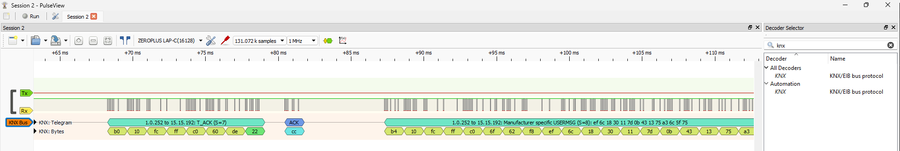

# Sigrok KNX Decoder

This project contains stuff for the open-source Sigrok signal analysis software.
See www.sigrok.org

Example on how to capture a recording on the commandline:  
`sigrok-cli -d fx2lafw --time 20s --config samplerate=100k --channels 0=ETS,1=FT12,2=BUS -t ETS=10 -w -o mycapture.sr`

This captures 20 seconds at 100kHz from the 3 channels of the fx2lafw logic analyzer 
(any Saelae Logic / USBee compatible device). The capturing starts when the channel "ETS"
changes from 1 to 0.  The result is stored in mycapture.sr

## Installation
Copy the content of the [decoders](decoders) directory to the place where your Sigrok decoders are installed.  

The [decoders/knx](decoders/knx) directory contains protocol decoder for Pulseview version >=0.4.1 (API 3.0).  
The [decoders/eib](decoders/eib) directory contains protocol decoder for Pulseview version <=0.4.0 (API 2.3).

Default Linux Sigrok decoders directory `/usr/share/libsigrokdecode/decoders` or `/usr/local/libsigrokdecode/decoders`    
Default Windows Sigrok decoders directory `C:\Program Files\sigrok\PulseView\share\libsigrokdecode\decoders`

